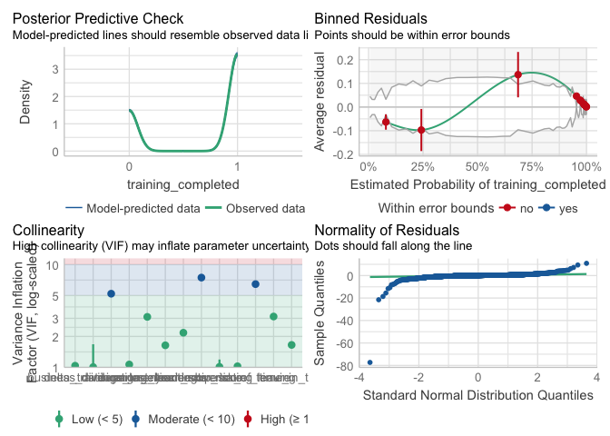
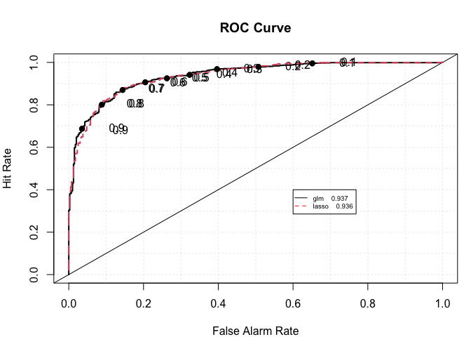

Technical Task - predict dropout of digital trainings
================
Stefan P. Thoma
2022-08-29

# Task


# Setup

Here we load packages and set some parameters for this project.

``` r
# First, we load packages we need
pacman::p_load("tidyverse", # keeps code tidy 
               "glmnet", # let's us compute lasso / ridge regressions
               "performance", # check model validity
               "InformationValue", # for the optimal cutoff
               "verification",# for the ROC curves
               "caret") 

# makes the results reproducible
set.seed(8725104)
```

## Load data

``` r
employee <- read_csv("data/employee.csv")
```

    ## Rows: 5000 Columns: 15
    ## ── Column specification ────────────────────────────────────────────────────────
    ## Delimiter: ","
    ## chr   (2): business_division, department
    ## dbl  (12): training_completed, engagement_score, tenure, leadership_score, o...
    ## date  (1): date
    ## 
    ## ℹ Use `spec()` to retrieve the full column specification for this data.
    ## ℹ Specify the column types or set `show_col_types = FALSE` to quiet this message.

``` r
performance <- read_csv("data/performance.csv")
```

    ## Rows: 2500 Columns: 3
    ## ── Column specification ────────────────────────────────────────────────────────
    ## Delimiter: ","
    ## chr  (1): rating
    ## dbl  (1): id
    ## date (1): date
    ## 
    ## ℹ Use `spec()` to retrieve the full column specification for this data.
    ## ℹ Specify the column types or set `show_col_types = FALSE` to quiet this message.

Here I have a first look at the data, mostly to determine how to combine
the two datasets. I would probably not include this step in a “real”
project, but I left it in to better demonstrate my process.

``` r
head(employee)
```

    ## # A tibble: 6 × 15
    ##   train…¹ busin…² depar…³ engag…⁴ tenure leade…⁵ overt…⁶ incid…⁷ durat…⁸ time_…⁹
    ##     <dbl> <chr>   <chr>     <dbl>  <dbl>   <dbl>   <dbl>   <dbl>   <dbl>   <dbl>
    ## 1       1 WM      GHL           3     16    6.13      29       1     113      15
    ## 2       1 WM      GHL           4     11    5.63      41       1      91      21
    ## 3       1 SB      GLI           4      9    5.95      41       2     136       6
    ## 4       1 SB      GHL           2     12    6.90      47       2      99      10
    ## 5       1 IB      AML           3     10    5.04      47       1     142      15
    ## 6       1 WM      HDO           4     17    3.51      53       1     162      23
    ## # … with 5 more variables: delta_trainings_last_year <dbl>,
    ## #   risk_of_leaving <dbl>, leadership_score2 <dbl>, date <date>, id <dbl>, and
    ## #   abbreviated variable names ¹​training_completed, ²​business_division,
    ## #   ³​department, ⁴​engagement_score, ⁵​leadership_score, ⁶​overtime, ⁷​incidents,
    ## #   ⁸​duration_elearning, ⁹​time_in_title

``` r
head(performance)
```

    ## # A tibble: 6 × 3
    ##      id date       rating              
    ##   <dbl> <date>     <chr>               
    ## 1     1 2019-02-26 Need for improvement
    ## 2     2 2019-02-14 Good                
    ## 3     3 2019-01-10 Need for improvement
    ## 4     4 2019-01-16 Good                
    ## 5     5 2019-02-07 Very good           
    ## 6     6 2019-02-08 Good

## Interpretation of the columns

**employee**

`training_completed` The variable we want to predict: Was the training
completed? 1 is yes, 0 is no. Categorical

`business_division` Describes in which business_division an employee
works. Categorical

`department` Describes in which department an employee works.
Categorical

`engagement_score` Measures engagement in class. Metric

`tenure` How long an employee has worked for CS. Metric

`leadership_score` Measures leadership quality. Metric

`overtime` How much overtime an employee has accumulated in hours.
Metric

`incidents` Counts number of incidents (not sure of what kind). Metric /
Count

`duration_elearning` Time spent with online class materials (outside of
class), likely in minutes. Metric

`time_in_title` Not sure

`delta_trainings_last_year` Not sure, sounds like a difference of
something

`risk_of_leaving` Continuous value between 0 and 1 representing the
probability of an employee leaving the company.

`leadership_score2` Maybe a transformation of `leadership_score`, maybe
a different aspect

`date` Date of data collection

`id` Employee identifyer. Categorical

**performance**

`id` Employee identifyer. Categorical

`date` date of performance measure

`rating` measure of work performance of employee. Categorical

## Bind dataframes and split into test and train

``` r
# first, we rename the `date` column

performance <- performance %>% rename(
  date_performance = date
)

# now bind the dataframes together

class_data <- merge(employee, performance, # the two df's to be merged
                    by = "id",# the employee identifyer for the merge
                    all = TRUE) # should we keep ids that do not appear in `performance`?
```

Let’s build a test and training set with a 25:75 split:

``` r
# percentage of training data
perc_train <- .75

train_ids <- sample(class_data$id, 
                    size =  floor(nrow(class_data)*perc_train),
                    replace = FALSE)

# create test and train dataframes
train_data <- class_data %>% filter(id %in% train_ids)
test_data <- class_data %>% filter(!id %in% train_ids)
```

# Explore and prepare

The first step is to look at the correlation plot. With so many
variables it would be difficult to see in this document. I did look at
it in a high resolution version and I do not include it here.

``` r
head(train_data)
```

    ##   id training_completed business_division department engagement_score tenure
    ## 1  1                  1                WM        GHL                3     16
    ## 2  2                  1                WM        GHL                4     11
    ## 3  3                  1                SB        GLI                4      9
    ## 4  4                  1                SB        GHL                2     12
    ## 5  5                  1                IB        AML                3     10
    ## 6  7                  1                AM        NAP                3     13
    ##   leadership_score overtime incidents duration_elearning time_in_title
    ## 1         6.125277       29         1                113            15
    ## 2         5.631186       41         1                 91            21
    ## 3         5.951434       41         2                136             6
    ## 4         6.901432       47         2                 99            10
    ## 5         5.038099       47         1                142            15
    ## 6         7.856126       57         1                 64            13
    ##   delta_trainings_last_year risk_of_leaving leadership_score2       date
    ## 1                         4       0.6328622        0.31816950 2019-02-26
    ## 2                         4       0.4226769       -0.37921454 2019-02-14
    ## 3                         5       0.6347266        0.07279929 2019-01-10
    ## 4                         5       0.5941287        1.41367484 2019-01-16
    ## 5                         5       0.5852076       -1.21632748 2019-02-07
    ## 6                         4       0.7517283        2.76117756 2019-03-08
    ##   date_performance               rating
    ## 1       2019-02-26 Need for improvement
    ## 2       2019-02-14                 Good
    ## 3       2019-01-10 Need for improvement
    ## 4       2019-01-16                 Good
    ## 5       2019-02-07            Very good
    ## 6       2019-03-08                 Good

``` r
summary(train_data)
```

    ##        id       training_completed business_division   department       
    ##  Min.   :   1   Min.   :0.0000     Length:3750        Length:3750       
    ##  1st Qu.:1253   1st Qu.:0.0000     Class :character   Class :character  
    ##  Median :2510   Median :1.0000     Mode  :character   Mode  :character  
    ##  Mean   :2516   Mean   :0.7045                                          
    ##  3rd Qu.:3792   3rd Qu.:1.0000                                          
    ##  Max.   :4999   Max.   :1.0000                                          
    ##                                                                         
    ##  engagement_score     tenure      leadership_score    overtime    
    ##  Min.   :1.000    Min.   : 1.00   Min.   : 1.000   Min.   : 0.00  
    ##  1st Qu.:3.000    1st Qu.: 9.00   1st Qu.: 4.748   1st Qu.:34.00  
    ##  Median :3.000    Median :11.00   Median : 5.690   Median :42.00  
    ##  Mean   :3.151    Mean   :10.53   Mean   : 5.678   Mean   :41.81  
    ##  3rd Qu.:4.000    3rd Qu.:12.00   3rd Qu.: 6.621   3rd Qu.:50.00  
    ##  Max.   :5.000    Max.   :19.00   Max.   :10.000   Max.   :82.00  
    ##                                                                   
    ##    incidents     duration_elearning time_in_title   delta_trainings_last_year
    ##  Min.   :0.000   Min.   :  0.0      Min.   : 1.00   Min.   :0.000            
    ##  1st Qu.:1.000   1st Qu.: 92.0      1st Qu.:11.00   1st Qu.:4.000            
    ##  Median :1.000   Median :118.0      Median :15.00   Median :5.000            
    ##  Mean   :1.349   Mean   :116.8      Mean   :14.81   Mean   :4.652            
    ##  3rd Qu.:2.000   3rd Qu.:142.0      3rd Qu.:18.00   3rd Qu.:5.000            
    ##  Max.   :3.000   Max.   :250.0      Max.   :30.00   Max.   :8.000            
    ##                                                                              
    ##  risk_of_leaving  leadership_score2      date            date_performance    
    ##  Min.   :0.0000   Min.   :-6.9159   Min.   :2019-01-01   Min.   :2019-01-01  
    ##  1st Qu.:0.4211   1st Qu.:-1.6253   1st Qu.:2019-01-24   1st Qu.:2019-01-24  
    ##  Median :0.5083   Median :-0.2967   Median :2019-02-14   Median :2019-02-13  
    ##  Mean   :0.5144   Mean   :-0.3137   Mean   :2019-02-14   Mean   :2019-02-13  
    ##  3rd Qu.:0.6052   3rd Qu.: 1.0184   3rd Qu.:2019-03-08   3rd Qu.:2019-03-08  
    ##  Max.   :1.0000   Max.   : 5.7871   Max.   :2019-03-31   Max.   :2019-03-31  
    ##                                                          NA's   :1882        
    ##     rating         
    ##  Length:3750       
    ##  Class :character  
    ##  Mode  :character  
    ##                    
    ##                    
    ##                    
    ## 

It looks like `date` and `date_performance` are the same, let’s confirm
this. Also, we check what’s the difference between leadership score and
leadership score 2. We also want to replace the NAs of the ratings
(where we don’t know the rating). I replaced it here with the character
“NA”, so it will be modeled like an additional category. Some modeling
funcitons would otherwise discard the rows with missing entries.

Alternatively, we could model and predict the missing ratings based on
the other variables.

``` r
summary(train_data$date == train_data$date_performance)
```

    ##    Mode    TRUE    NA's 
    ## logical    1868    1882

``` r
# Yep
cor(train_data$leadership_score, train_data$leadership_score2)
```

    ## [1] 1

``` r
# looks like one is just a transformation of the other.
```

Further, the data type of some columns do not correspond to the data
type that seems sensible.

Let’s build a function to fix these aspects. This will allow us to treat
the test data the same way later.

``` r
names(test_data)
```

    ##  [1] "id"                        "training_completed"       
    ##  [3] "business_division"         "department"               
    ##  [5] "engagement_score"          "tenure"                   
    ##  [7] "leadership_score"          "overtime"                 
    ##  [9] "incidents"                 "duration_elearning"       
    ## [11] "time_in_title"             "delta_trainings_last_year"
    ## [13] "risk_of_leaving"           "leadership_score2"        
    ## [15] "date"                      "date_performance"         
    ## [17] "rating"

``` r
clean_data <- function(dat){
  
dat <- dat %>% dplyr::select(-date_performance, -leadership_score2) %>%
  mutate(rating = ifelse(is.na(rating), "NA", rating )) %>%
  mutate(across(c("training_completed", "business_division", "department", "rating"),
                as_factor)) %>%
  mutate(across(.cols = c("engagement_score", "tenure", "leadership_score", "overtime", "incidents", "duration_elearning", "time_in_title", "delta_trainings_last_year", "risk_of_leaving"), scale))

return(dat)
}
```

Clean training data

``` r
train_data <- clean_data(train_data)
```

For `glmnet` we need a slightly different format:

``` r
#train_data
train_x <- model.matrix(data = train_data, training_completed ~ . - id)
train_y <- train_data$training_completed
```

# Build model

First a simple glm model to check predictors:

``` r
glm_model <- glm(training_completed ~. -id, family = "binomial", data = train_data)

summary(glm_model)
```

    ## 
    ## Call:
    ## glm(formula = training_completed ~ . - id, family = "binomial", 
    ##     data = train_data)
    ## 
    ## Deviance Residuals: 
    ##     Min       1Q   Median       3Q      Max  
    ## -4.1704  -0.2536   0.1664   0.4320   3.0938  
    ## 
    ## Coefficients:
    ##                             Estimate Std. Error z value Pr(>|z|)    
    ## (Intercept)               -1.342e+01  3.756e+01  -0.357   0.7209    
    ## business_divisionSB       -2.299e-01  1.505e-01  -1.527   0.1267    
    ## business_divisionIB        1.364e-01  1.519e-01   0.898   0.3690    
    ## business_divisionAM        2.556e-02  1.543e-01   0.166   0.8684    
    ## departmentGLI             -3.486e-03  2.429e-01  -0.014   0.9886    
    ## departmentAML             -3.390e-02  2.399e-01  -0.141   0.8876    
    ## departmentNAP             -1.681e-01  2.458e-01  -0.684   0.4940    
    ## departmentZEF             -2.446e-01  2.446e-01  -1.000   0.3174    
    ## departmentADC              5.014e-01  2.503e-01   2.004   0.0451 *  
    ## departmentPOR              5.004e-02  2.420e-01   0.207   0.8362    
    ## departmentQHA              1.449e-01  2.405e-01   0.603   0.5467    
    ## departmentHDO              1.676e-01  2.481e-01   0.676   0.4992    
    ## departmentABD             -5.123e-02  2.393e-01  -0.214   0.8304    
    ## engagement_score           5.256e-01  7.175e-02   7.326 2.38e-13 ***
    ## tenure                    -3.814e-01  9.442e-02  -4.039 5.37e-05 ***
    ## leadership_score          -7.387e-01  1.458e-01  -5.066 4.06e-07 ***
    ## overtime                   1.034e-01  5.406e-02   1.913   0.0557 .  
    ## incidents                 -3.390e-01  7.839e-02  -4.324 1.53e-05 ***
    ## duration_elearning        -2.974e+00  1.315e-01 -22.623  < 2e-16 ***
    ## time_in_title              6.205e-01  6.257e-02   9.917  < 2e-16 ***
    ## delta_trainings_last_year -1.214e+00  1.264e-01  -9.609  < 2e-16 ***
    ## risk_of_leaving            1.219e+00  1.384e-01   8.805  < 2e-16 ***
    ## date                       8.469e-04  2.094e-03   0.404   0.6859    
    ## ratingGood                -1.039e-01  1.876e-01  -0.554   0.5799    
    ## ratingVery good            7.333e-02  1.893e-01   0.387   0.6985    
    ## ratingNA                   4.752e-02  1.588e-01   0.299   0.7647    
    ## ---
    ## Signif. codes:  0 '***' 0.001 '**' 0.01 '*' 0.05 '.' 0.1 ' ' 1
    ## 
    ## (Dispersion parameter for binomial family taken to be 1)
    ## 
    ##     Null deviance: 4552.3  on 3749  degrees of freedom
    ## Residual deviance: 2231.8  on 3724  degrees of freedom
    ## AIC: 2283.8
    ## 
    ## Number of Fisher Scoring iterations: 6

``` r
check_model(glm_model)
```

<!-- -->

`risk_of_leaving` and `leadership_score` have the highest VIFs. This
does not influence the prediction quality but may have an impact on
which predictors become significant.

This model is well suited to figure out which predictors carry weight.
We can easily identify the six variables with the highest z-scores:

``` r
data.frame(summary(glm_model)$coefficients) %>% 
  filter(abs(z.value)>5) %>%
  arrange(desc(abs(z.value)))
```

    ##                             Estimate Std..Error    z.value      Pr...z..
    ## duration_elearning        -2.9741416 0.13146302 -22.623408 2.550019e-113
    ## time_in_title              0.6204853 0.06257074   9.916541  3.527694e-23
    ## delta_trainings_last_year -1.2142956 0.12636818  -9.609188  7.312313e-22
    ## risk_of_leaving            1.2186392 0.13839729   8.805369  1.304228e-18
    ## engagement_score           0.5256390 0.07175385   7.325586  2.378570e-13
    ## leadership_score          -0.7386561 0.14580145  -5.066178  4.058816e-07

To predict unobserved cases I would use a regularized version of glm,
e.g. a lasso glm. The lasso regression will detect the relevant
variables and set the coefficients of all others to 0. However, one
should be aware of collinear predictors.

``` r
# Fit cross validation to figure out best possible lamdba parameter
lasso_cv <- cv.glmnet(y = train_y, x = train_x, family = "binomial",  alpha = 1)

# extract lambda
lambda <- lasso_cv$lambda[which.min(lasso_cv$cvm)]

# Fit final model
lasso_model <- glmnet(y = train_y, x = train_x, family = "binomial", lambda = lambda, alpha = 1)

# display estimated coefficients 
coef(lasso_model)
```

    ## 27 x 1 sparse Matrix of class "dgCMatrix"
    ##                                      s0
    ## (Intercept)               -6.8972201036
    ## (Intercept)                .           
    ## business_divisionSB       -0.2199492711
    ## business_divisionIB        0.0996588475
    ## business_divisionAM        .           
    ## departmentGLI              .           
    ## departmentAML             -0.0004984992
    ## departmentNAP             -0.1377764298
    ## departmentZEF             -0.2159762284
    ## departmentADC              0.4587331102
    ## departmentPOR              0.0228393157
    ## departmentQHA              0.1183411022
    ## departmentHDO              0.1355405955
    ## departmentABD             -0.0242474351
    ## engagement_score           0.5480876376
    ## tenure                    -0.2681375123
    ## leadership_score          -0.5398826918
    ## overtime                   0.0896009276
    ## incidents                 -0.4108871342
    ## duration_elearning        -2.7925018290
    ## time_in_title              0.5763995998
    ## delta_trainings_last_year -1.0575480855
    ## risk_of_leaving            1.0287863118
    ## date                       0.0004836384
    ## ratingGood                -0.1106795537
    ## ratingVery good            0.0250625065
    ## ratingNA                   0.0053198771

# Predict and evaluate

First, we treat the `test_data` the same way we treated the
`train_data`:

``` r
test_data <- clean_data(test_data)


# test data
test_x <- model.matrix(data = test_data, training_completed ~ . - id)
test_y <- test_data$training_completed
```

Now we predict on the unseen test data to evaluate model performance

``` r
glm_pred <- predict(glm_model, newdata = test_data, type = "response")
lasso_pred <- predict(lasso_model, newx = test_x, type = "response")


test_data <- test_data %>% mutate(
  glm_pred = as.numeric(glm_pred),
  lasso_pred = as.numeric(lasso_pred),
  training_completed = as.numeric(training_completed)-1
)
```

## model performance

The most informative performance measure is the ROC plot, and the AUC:

``` r
roc.plot(test_data$training_completed, pred = cbind(test_data$glm_pred, test_data$lasso_pred), 
         legend = TRUE, leg.text = c("glm", "lasso"))
```

    ## Warning in roc.plot.default(test_data$training_completed, pred =
    ## cbind(test_data$glm_pred, : Large amount of unique predictions used as
    ## thresholds. Consider specifying thresholds.

<!-- -->

Here I extract more performance measures, such as accuracy and the
confusion matrix:

``` r
optimal_glm <- optimalCutoff(test_data$training_completed, test_data$glm_pred)
optimal_lasso <- optimalCutoff(test_data$training_completed, test_data$lasso_pred)

test_data <- test_data %>% mutate(
  glm_prediction = ifelse(glm_pred>optimal_glm, 1, 0),
  lasso_prediction = ifelse(lasso_pred>optimal_lasso, 1, 0)
)


# glm
confusionMatrix(reference = as_factor(test_data$training_completed), data = as_factor(test_data$glm_prediction))
```

    ## Confusion Matrix and Statistics
    ## 
    ##           Reference
    ## Prediction   0   1
    ##          0 301  65
    ##          1  95 789
    ##                                         
    ##                Accuracy : 0.872         
    ##                  95% CI : (0.8522, 0.89)
    ##     No Information Rate : 0.6832        
    ##     P-Value [Acc > NIR] : < 2e-16       
    ##                                         
    ##                   Kappa : 0.6982        
    ##                                         
    ##  Mcnemar's Test P-Value : 0.02187       
    ##                                         
    ##             Sensitivity : 0.7601        
    ##             Specificity : 0.9239        
    ##          Pos Pred Value : 0.8224        
    ##          Neg Pred Value : 0.8925        
    ##              Prevalence : 0.3168        
    ##          Detection Rate : 0.2408        
    ##    Detection Prevalence : 0.2928        
    ##       Balanced Accuracy : 0.8420        
    ##                                         
    ##        'Positive' Class : 0             
    ## 

``` r
# lasso
confusionMatrix(reference = as_factor(test_data$training_completed), data = as_factor(test_data$lasso_prediction))
```

    ## Confusion Matrix and Statistics
    ## 
    ##           Reference
    ## Prediction   0   1
    ##          0 327  90
    ##          1  69 764
    ##                                          
    ##                Accuracy : 0.8728         
    ##                  95% CI : (0.853, 0.8908)
    ##     No Information Rate : 0.6832         
    ##     P-Value [Acc > NIR] : <2e-16         
    ##                                          
    ##                   Kappa : 0.7103         
    ##                                          
    ##  Mcnemar's Test P-Value : 0.1127         
    ##                                          
    ##             Sensitivity : 0.8258         
    ##             Specificity : 0.8946         
    ##          Pos Pred Value : 0.7842         
    ##          Neg Pred Value : 0.9172         
    ##              Prevalence : 0.3168         
    ##          Detection Rate : 0.2616         
    ##    Detection Prevalence : 0.3336         
    ##       Balanced Accuracy : 0.8602         
    ##                                          
    ##        'Positive' Class : 0              
    ## 

# Conclusion

The models were validated on unseen (test) data. This means that the
model performance reported should reflect real world performance as good
as possible.

For both models we get a prediction accuracy of around 87% compared to
the No Information Rate of 68%. We can identify around 77% (resp. 83%)
of employees who did not finish the class (sensitivity). Caveat: The
difference in model performance in sensitivity is most likely due to the
different cutoff point. Of the 876 employees who did finish the class
only around 10% were misclassified as abandoning the class. These
predictions were based on the cutoff of around 50% (resp. 60%)
probability which optimised accuracy.

Both the lasso and the glm model showed a high AUC of around .93,
further substantiating the model quality.

There were nine predictors with a significant coefficient in the glm
model. However, six of them stood out as strong predictors with much
larger z scores. The most influential predictors:

`duration_elearning`: The longer the duration, the less likely to
finish. `delta_trainings_last_year`: Higher delta means less likely to
finish. `time_in_title`: More time in title means more likely to finish.
`risk_of_leaving`: Apparently, higher risk of leaving is associated with
a higher chance of finishing. `engagement_score`: High engagement means
more likely to finish `leadership_score`: higher score means less likely
to finish.

The results of `time_in_title` and `risk_of_leaving` are difficult to
explain, as I am not sure what `time_in_title` represents. The effect of
`risk_of_leaving` seems unintuitive to me.

**Improvements**

I did not take a clear look at the variables `business_division` and
`department`, which would have to be tested via model comparison. They
did not appear to have a large influence. The seemingly hierarchical
structure of the two variables would likely warrant a hierarchical
modeling approach, at least for the departments (as there are I think
9). In that scenario I might discard the `business_division` completely.

Further, a transformation of some variables to reduce collinearity of
the predictors might be in order. Also, so far no interactions were
considered.

If the prediction would be the main goal, a random forest approach may
yield even better results and should be considered for this task.
